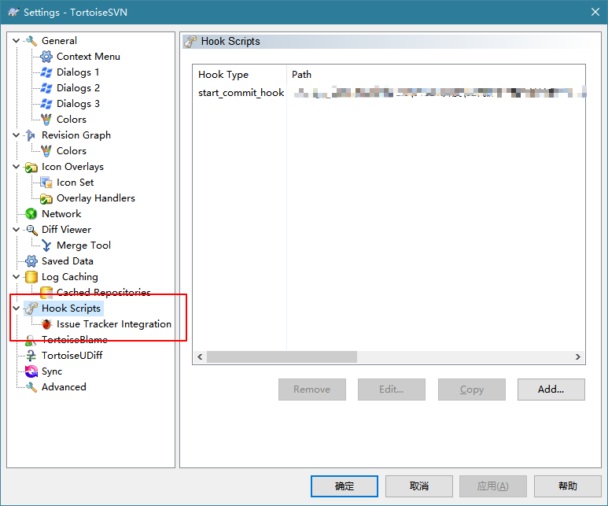
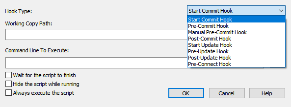
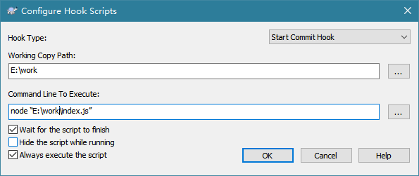
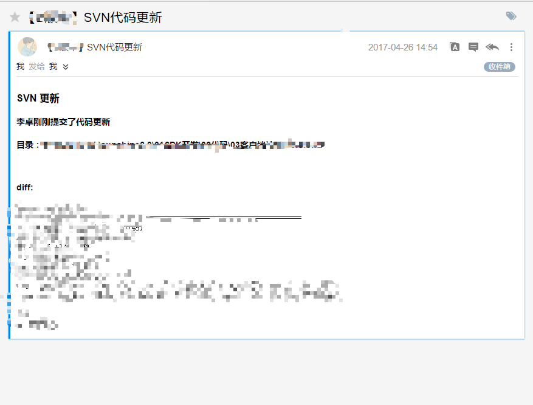

# 曲线救国之SVN客户端钩子
此方法使用于没有权限到SVN仓库服务器设置钩子。  
## How to do
首先客户端的hook是在TortoiseSVN里支持的，所以得先安装TortoiseSVN，我相信使用SVN的大部分人都安装了这个软件。然后在TortoiseSVN的设置里找到hook script。  
  
然后点击add添加自己的脚本  
  
这里选择的是脚本执行的时机，具体可以查看文档[doc](https://tortoisesvn.net/docs/nightly/TortoiseSVN_zh_CN/tsvn-dug-settings.html)  
我这里是使用了node脚本，并选择在开始提交前执行，当然，你也可以选择执行你自己熟悉的语言写的脚本，如java, c, Python等.  
  
上图中 我设置了开始提交前执行，用node执行index.js来进行代码检查（eslint）工作，并勾选等待脚本执行结束和总是执行此脚本，那么以后只要我对work目录下的文件进行提交，那么提交开始前它都会执行我的代码检查脚本。  然后你也可以设置提交代码后执行脚本发送邮件通知等功能。至于脚本怎么写我就不具体描述了。效果如图  
  

